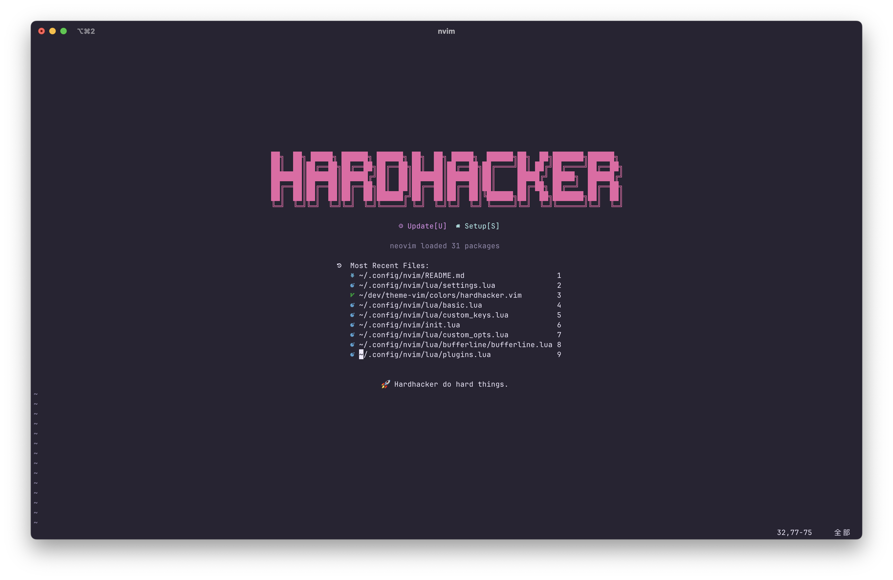
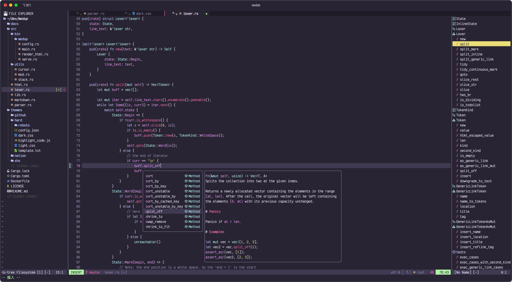
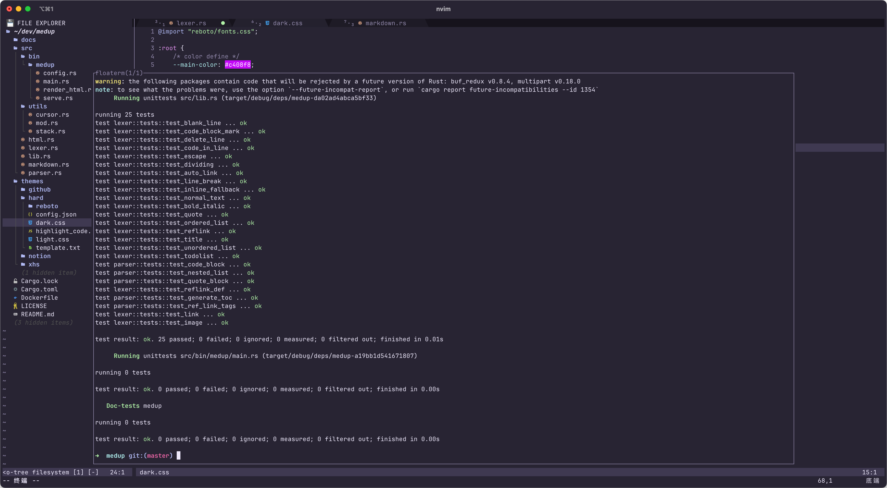
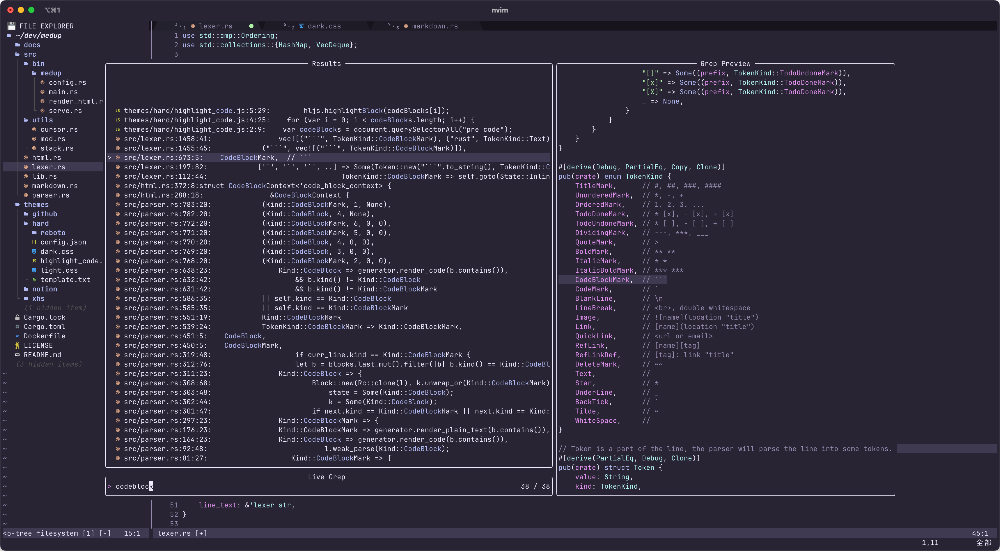
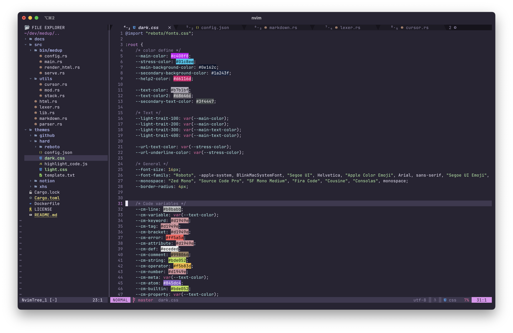

<p align="center">
  
</p>

<h1 align="center">
    oh-my-nvim<br/>
  <a href="https://discord.com/invite/MGmp9QjfkK">
    
  </a>
</h1>

A **theme-driven**, out-of-the-box modern configuration of neovim 💎

We developed a theme called [HardHacker](https://github.com/hardhackerlabs/themes), which we thought was pretty and eye friendly,
but we found that many neovim plugins have their own color scheme,
so we made a neovim integration environment that matches the hardhacker theme.

## 📦 Features

- Session load and switch
- File explorer
- File find and search
- Float terminal
- LSP
- Pretty code highlighting, Colors highlighting
- Auto completion
- Languages
- Git integration
- Git diff view
- Pretty Tab line, Status line
- Markdown Preview via your browser
- Starting screen
- Quick resize the window
- Customization of frequently used shortcuts
- ...

## 🎆 Preview







## 📸 Load and switch project

The preview shows opening a project and then switching to another project.
Here the project is loaded and switched via nvim's session.
Thus, a project is a session.


When nvim is started in a directory, it is created as a session based on that directory,
so we can always start nvim in the root directory of a project.

We can use the `<leader>ss` shortcut (by default) to select and switch a project(session).

## 📌 Requirements

- Neovim 0.8+
- Not required, but recommended
  - [nerd font](https://www.nerdfonts.com/font-downloads)
    - Victor Mono Nerd Font
    - JetBrainsMono Nerd Font
    - ...
  - [ripgrep](https://github.com/BurntSushi/ripgrep)
  - [fd](https://github.com/sharkdp/fd)

## 🚧 Install

#### MacOS/Linux

0️⃣ **Backup your current nvim**

```
mv ~/.config/nvim       ~/.config/nvim.bak
mv ~/.local/share/nvim  ~/.local/share/nvim.bak
```

1️⃣ **Clone oh-my-nvim repo**

```
git clone https://github.com/hardhackerlabs/oh-my-nvim.git ~/.config/nvim
```

2️⃣ **Start `nvim` in your terminal, then automatically install and setup all plugins**

3️⃣ **Restart `nvim` and enjoy it** 🍻

4️⃣ **Keep updated**

## ⌛️ Update

You should keep updated, it's great.

You can use `git pull` to update it. If you've edited something, you may need to merge the content manually, just like a normal git operation.

## 🧱 Languages

#### Install LSP Server

Use command `:LspInstall` to download and install a server, e.g. `:LspInstall rust_analyzer`.

#### Install TreeSitter Parser

Use command `:TSInstall` to download and install a parser, e.g. `:TSInstall rust`.

## 🏠 Custom

#### 🔍 Configuration structure

```
~/.config/nvim/
├── init.lua
├── lazy-lock.json
└── lua/
    ├── plugins/
    │   └── ...
    ├── languages/
    │   └── ...
    ├── my_plugins/
    │   └── ...
    ├── basic.lua
    ├── custom.lua
    ├── custom_keys.lua
    ├── custom_opts.lua
    └── settings.lua
```

- ~/.config/nvim/lua/**my_plugins/**

  You can put the plugins you want into the directory.

- ~/.config/nvim/lua/**custom.lua**

  This file does not exist by default, you can create this file, then place some custom configuration logic, the custom.lua module will be loaded last.

#### ⌨️ Shortcut Keys

[👉 View the default shortcut settings](https://github.com/hardhackerlabs/oh-my-nvim/blob/main/lua/custom_keys.lua)

You can edit the default settings of the shortcut keys in this configuration file (`~/.config/nvim/lua/custom_keys.lua`).

#### 😍 Add the plugins you want

If you want to add your own plugins, you can create a `plugin_name.lua` file in the directory `~/.config/nvim/lua/my_plugins`. Setup the plugins in this file.

The plugin configuration in the `plugin_name.lua` file refers to the following template (lazy.nvim syntax):

```
return {
    -- Your Plugin1
    {
        'hardhacker/plugin1',
        config = function() ... end
    },

    -- Your Plugin2
    {'hardhacker/plugin2'},
}
```

#### 💯 Recommended plugins

Some useful plugins are configured by default in the directory `~/.config/nvim/misc/recommended`,
but they are not loaded into neovim by default ,
so if you need them, you can copy them into the directory `~/.config/nvim/lua/my_plugins/`.

Example:

```
cp ~/.config/nvim/misc/recommended/markdown.lua ~/.config/nvim/lua/my_plugins/
```

## 🧩 Plugins

[👉 View all plugins integrated](./docs/plugins.md)

Use **lazy.nvim** to manage plugins.

## 💖 Recommendations for Neovim GUI

- [Neovide](https://neovide.dev/) (Developed by rust)
